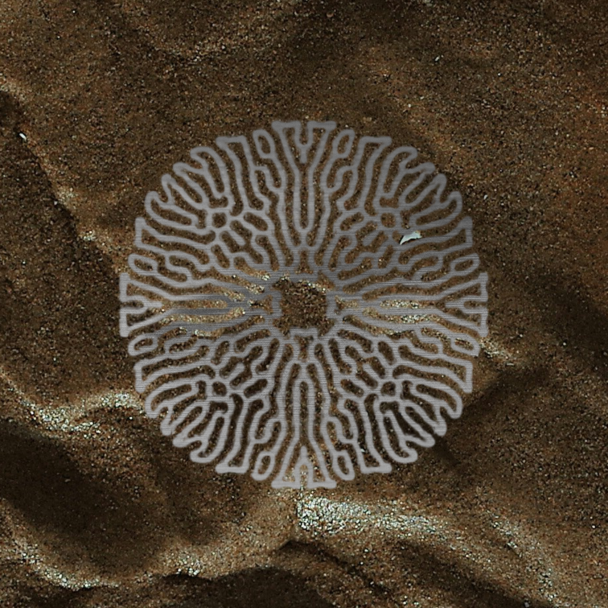

> reality is held in balance by \
> just a few strings, connecting stars in the sky \
> mankind's quest for meaning \
> reveal **three thousand realms** \
> in a single moment \
> or maybe, infinity in a grain of sand \
> but we all prefer to keep our \
> **third eye** blind \
> wear faces in passing \
> "hello, how do you do?" \
> hiding subtle grins \
> at the fatalism of it all \
> that reality might be \
> but three steps away from 
> the closest booth, 
> dial the number \
> **exitsimulation** \
> — the shepherd :: year 001, post eclipse

## the hunt

In the waking hours of the hour of the fowl, the forest floor of **silent valley** was quiet, in the third season of **the hunt**. 

The forest was shrouded in mist; one could barely see past the serpentine vines of the thicket. A deep tone, dark and beckoning, spoke to the darkness of **silent valley**. There was no sun, and no light, save for the ocean of despair in the departure of life.

Beyond the bramble of towering pine fortresses stood **the spiral**. A tall, concrete ark-hollowed out and solid. No doors. No windows. No cracks. Just a massive slab with corridors stretching out like bridges into the mist above **silent valley**. No vines. No moss. No sign of life. It was out of place - alien in the thick jungle. Where did it come from? What was it for? Who built it?

The animals worshiped **the spiral** as an ancient force of nature. Legend said all that approached would wither to ash and aether. But once every two hundred and seventy-six days, a tiny slit of light would emerge, giving way to three beacons of light, shooting into the sky. They called this event **the flash**. It would only last for one week, but it was enough for the animals of **silent valley** to bask in it's light and rejoice. Sound and color would fill the void of **silent valley**'s mist. 

Flowers would bloom momentarily and the trees would sing to each other.

And then the slit would close. 

The animals had all sorts of myths about **the spiral**. Some of the elders claimed that, **the spiral** was alive, dormant, waiting to hatch. Every once in a while, the spiders would hear whispers of footsteps emerging to and from the spiral, but no figure could be seen or heard.

Each year, **silent valley** would commemorate a countdown to **the flash** with **the hunt**. As tradition would permit, **the tiger** of **silent valley** would be bestowed with the honor of ringing the bell to commemorate the start of **the flash**. 

****the tiger**** sat at the top of his throne on **the apex** rock, gnawing at the bones of his youngest cub. A ruthless predator and self-proclaimed king of **silent valley**. 

**the tiger** had six eyes, a gargantuan muscular physique, and a iridescent translucent skin adapted for hiding and hunting in plain sight. With a single blink, he could disappear into nothingness and hunt all animals in his vicinity and reappear exactly where he sat without giving his prey a moment to anticipate his next move. One could not look **the tiger** in the eye. If one did, it meant a certain, swift death. **the tiger** was not the harbinger of fear. **the tiger** was fear itself.

All the animals of **silent valley** bent the knee to **the tiger**'s shadow, and in exchange for his mercy, offered him trinkets of service. Over the years, **the tiger** had built up an empire of sorts - a drug ring he called **the candy factory**. The factory sold **the candy** to neighboring warlords in exchange for **photon**. 

**photon** was currency and **the tiger** was the debt collector.

++

**the tiger** looked at the faint shadow of the moon.

> **+full moon+** :: he thought :: **four blinks** 🐅 

He sniffed the air for the scent of ashen blood dust. 

> **musty** :: he reminisced ::  **two blinks** 🐅

Faint, lingering, but it was certainly there. 

The weight of his ancestors knew what that meant.

++

> "time for **the hunt** to begin" 🐅 

++

**the tiger** rose up from his seat and growled, blinking one eye at a time. The archers dipped their arrows in fire from the trees and shot. **the ape** blew the horn of **the hunt**. The boar squealed and writhed in anticipation from the shackles of his iron cage. The battle drums of **silent valley** started to turn the forest floor into a ritual ground for sacrifice. 

And so began the song of the hunt.

++

> the hunt begins with an arrow in the sky \
> the boar knows he must run \
> for the game must be played \
> three wolves run through the thicket \
> weaving in and out of the woodwork \
> the tiger must deliver the final blow \
> so his cubs and maiden do his bidding \
> the beast, birds and monkeys \
> scout from above \
> the forest floor rumbles, for the trees \
> speak in networks \
> the boar trips on a vine, stumbles \
> and twists his head and breathes a final sigh \
> just circumstance, but now the wolves, \
> the tiger and his crew can triumph \
> the hunt is over, they won \
> the forest breathes, anticipating \
> rain, dust and sunny days \
> — the ape

&nbsp;

---

&nbsp;

## diffusion

A hooded figure stood above the puddle of blood where **the boar** once fell. 

he had pale skin with silver white tattoos running like circuitry around his entire body. he was neither dead nor alive - a bio-luminescent ghost trapped between time and space. 

He looked around for signs of life. Nothing. **the tiger** left not a shred of sinew on the bones of the poor beast. 

>  ***+scent+*** he thought 🦌

**the figure** stooped down and took a sample of what remained, and muttered a hymn of requisition.

**the figure** wrote down an inscription on the flask and slipped it into his bag of vials. 

Painting three dots on the forest floor, **the figure** drew a diffusion map. 

the sand of the forest floor began to shift into a pattern of twisting roots. water seeped into the center of the hole at the base of **the figure**'s feet. it rose to his knees, and as he looked up, two antlers grew from the base of his head. His silhouette twisted into a seven foot tall shadow of a humanoid elk hybrid.

> ***+transformation+*** 🦌

His eyes constricted into narrow slits, as his spirit became one with the silence of the forest.

> ***+touch+*** 🦌

With a hush, he disappeared into a slit in the fabric of the forest. Not a sound or soul saw or heard where he had been.

All that was left was the faint silver pool of the diffusion map.

> ***+vision+*** 🦌

Somewhere in the depths of **the spiral**, at that very same moment, a faint light emerged in the abyss.
