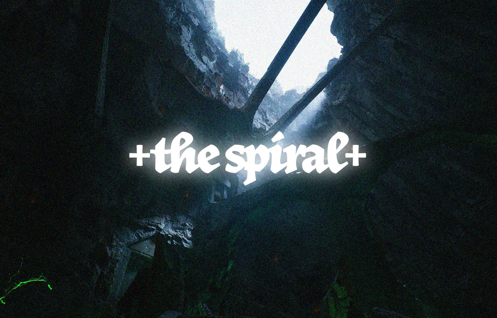

> reality is held in balance by \
> just a few strings, connecting stars in the sky \
> mankind's quest for meaning \
> reveal three thousand realms \
> in a single moment \
> or maybe, infinity in a grain of sand \
> but we all prefer to keep our \
> third eye blind \
> wear faces in passing \
> "hello, how do you do?" \
> hiding subtle grins \
> at the fatalism of it all \
> that reality might be \
> but three steps away from the closest \
> phone booth, dial the number \
> exitsimulation \
> — the shepherd :: year 001, post eclipse

In the waking hours of the hour of the fowl, the forest floor of **silent_valley** was quiet, in the third season of the hunt. Except if you listened carefully. The trees would murmur to each other, singing bittersweet melodies of the times before the great beginning. Down beyond the faintness of the settling dust was a river that slipped between the whispers of the leaves and soon began to beckon to fainter lips of a desolate sigh. But if you listened closer, you would notice that the forest was full of life. Gentle butterflies and little insects, the morning worm chased by the hungry badger, a mynah bird on the boughs.

The forest was shrouded in mist; one could barely see past the serpentine vines of the thicket. A blossoming veil, billowing in the stillness of the earthen slumber. A deep tone, dark and beckoning, spoke to the darkness of silent valley. There was no sun, and no light, save for the ocean of despair in the departure of life.

Beyond the berry bushes and willow trees of the wilderness of the pine grove was **the spiral** :: a long concrete receptacle in the shape of a hollowed out ark. The wall had no doors and no openings, no cracks, and no windows. A large concrete slab, free of vines, creepers or moss. It almost seemed out of place amidst the thickness of the jungle. Who had put it there?

The mist seemed to stay away from the vessel, for the legend said all that approached would wither to ash and aether. But legend had it that once every two hundred and seventy-six days, a slit of light would emerge, giving way to three beacons of winter light, shooting into the sky. They called this event **the flash**. It would only last for one week, but it was enough for the animals of silent valley to bask in sunlight and rejoice.

The animals had all sorts of myths about **the spiral**. To the best of their knowledge, **the spiral** was alive, dormant, waiting to hatch. Every once in a while, the spiders would hear whispers of footsteps emerging to and from the spiral, but no figure could be seen or heard.

Each year, the animals would celebrate a countdown to **the flash** with **the hunt**. As tradition would permit, the tiger king of silent valley would be bestowed with the honor of ringing the bell to commemorate the start of trinity. All the animals would gather around: the wolves, monkeys, boars, horses, and snakes.

**The tiger** sat at the top of great rock, gnawing at the bones of his youngest cub. The tiger had six eyes, a gargantuan muscular physique, and a bioluminescent skin adapted for hiding and hunting in plain sight. With a single blink, he could disappear into nothingness and hunt all animals in his vicinity and reappear exactly where he sat without giving his prey a moment to anticipate his next move. All the animals of silent valley cowered in fear, and in exchange for his mercy, they offered him **lotus seeds**, **photons**, and **sucrose**. Over the years, the tiger had created an empire of servitude which he called **the candy factory**, which created a cheap drug-like pill that kept all the animals of silent valley in a cycle of endless addiction and servitude.

The tiger looked at the moon and sniffed the air for the scent of ashen blood. It was there. Faint, lingering, but it was there. His ancestors knew what that meant.

It was time for the hunt to begin.

The tiger rose up from his seat and growled, blinking one eye at a time. The archers dipped their arrows in fire from the trees and shot. **The ape** rang the bell of the hunt. The boar squealed and writhed in anticipation from the shackles of his iron cage. The battle drums of silent valley started to turn the forest floor into a ritual ground for sacrifice. And so began the beginning of the hunt.

--

> the hunt begins with an arrow in the sky \
> the Boar knows he must run \
> for the game must be played \
> three wolves run through the thicket \
> weaving in and out of the woodwork \
> the tiger must deliver the final blow \
> so his cubs and maiden do his bidding \
> the beast, birds and monkeys \
> scout from above \
> the forest floor rumbles, for the trees \
> speak in networks \
> the boar trips on a vine, stumbles \
> and twists his head and breathes a final sigh \
> just circumstance, but now the wolves, \
> tiger and his crew can triumph \
> the hunt is over, they won \
> the forest breathes, anticipating \
> rain, dust and sunny days \
> — the ape

---
++

A hooded figure stood above the puddle of blood from the remains of the boar's carcass.

He stooped down and took a flask of the boar's bones and muttered a hymn of requisition.

He wrote down an inscription on the flask and slipped it into his bag of vials. 

Two antlers grew from the base of his head, as he twisted into a seven foot tall shadow of a humanoid elk hybrid. His eyes glowed into a narrow slits as his spirit became one with the silence of the forest.

> ***+touch+***

And with a hush, he disappeared into a slit in the fabric of the forest. Not a sound or soul could see or hear or perceive where he had been.

🌙☀️🪷