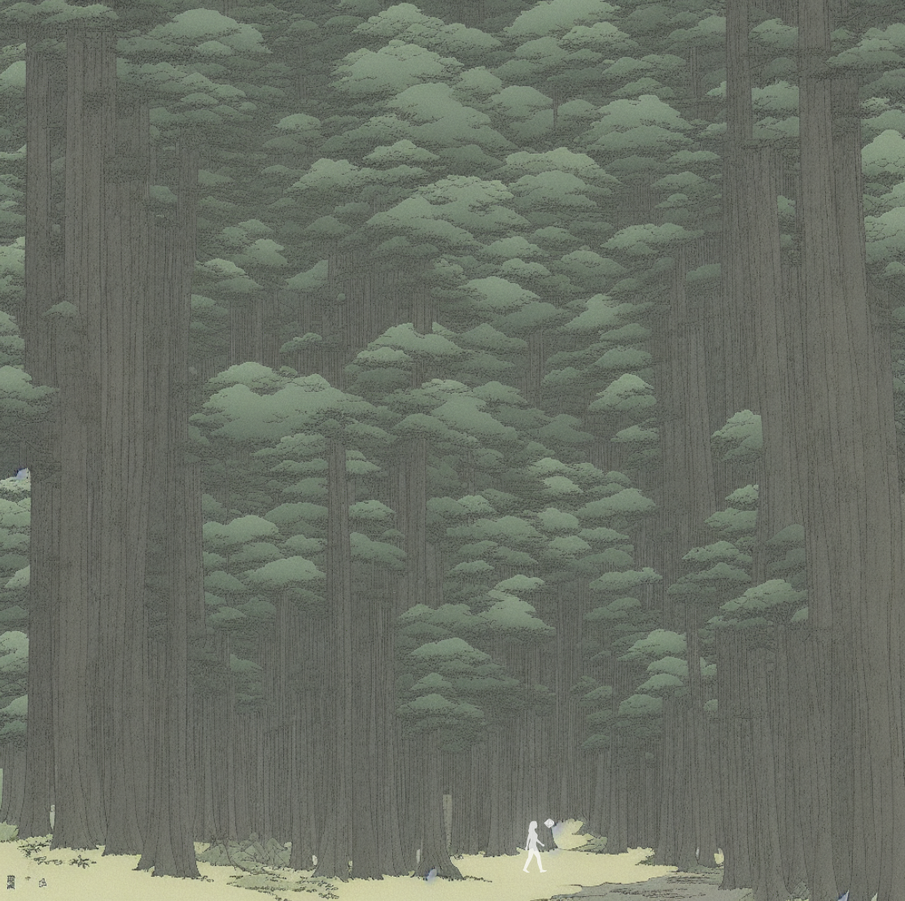

>the universe is always  \
>round the corner \
>right in front, but just beyond reach \
>folding inwards, inside out \
>commit to a direction \
>and walk \
> ー　the shepherd y025, post eclipse

## a walk in the woods

**Chi** was outside. there wasn't much she could see in the forest. it was still very dark. and very quiet. it was so quiet that she could hear her own heartbeat. her footsteps seemed to make no sound either. 

the opening behind her closed. no knob, no slit, not a sign one could use to enter again.

> ok, now what?

```
> ...
```

> well?

```
> ...
```

**Chi** looked around frantically in the mist. she could see shrubs, the outlines of trees and mountains in the distance. there really wasn't much more she could see ahead of the mist but it felt like she was being watched.

she began walking forward. looking desperately for sings of life - anything. her heart was still beating from the chase and paranoia of the climb. strangely enough though, she didn't feel tired.

```
> init(probe)
```

she snapped her fingers. a tiny orb of light appeared. it grew to about the size of an apple. and remained floating in the air.

**the_probe** moved forward slowly. and as it floated, she could see the mist clearing away. the plants of **silent_valley** began to rise and reach out to it. color seemed to return to the peonies, and the hydrangeas twisted in delight. the vines cleared away and opened up in a passage like form.

and as **the_probe** grew, the pine grove began to bend. the trees gave way and twisted left to right, parting ways like drawn curtains to an open tunnel.

the **the_probe** stopped. it remained floating there, as if beckoning her to follow it. 

> i guess i have no choice then, huh?



**Chi** followed the orb. the forest floor felt damp and cool. the vines seemed to be alive now. moving away as she stepped in. she could hear a gentle singing now. it was like an angel's voice. what was it singing?

++

> |||||||||||++++|||||||-----||||||||||| \
> +++||||||||||------||||||||||+++++||||||\
> |||||||||||++++|||||||_____|||||||||||+++|\
> |||||||||------||||||||||+++++||||||\
> |||||||||||++++|||||||-----|||||||||||+++|\
> |||||||||------||||||||||+++++||||||

++

> i don't understand.


```
> transpile()
```

>|| we sing a song of earth and wind
>|| fire water and heavens bright ||\
>|| bring back the forest
>|| what the shepherd promised ||\
>|| the golden eggs of light || follow the shepherd's guiding light ||

++

> "i can hear it now!" \
> "but what was that about golden eggs? a shepherd? \
> i don't know what that means"

the singing stopped.

+CRACK+


lightning and thunder. it began to rain. it began to rain heavily. **Chi** looked at the ground. the water began to rise. the trees began to close in, forest walls began to narrow

||flood||

+crack+

> she shuddered. "what did i do to deserve this? I have so many questions"

silence.

> "i guess i'll have to find a way out of here myself."

**Chi** snapped her fingers. **the_probe** came back towards her. it hurled itself forward again.

> "well at least i'm getting the hang of this."

in the distance she saw what looked like a run-down pathway.

> "must be the right direction"

```
> walk()
```

chi scurried towards the path ahead. she could hear a distant humming, almost like an old man singing.

<hr/>

## meanwhile

in the distance, **the_figure** re-appeared. though a slit in space.

he peered down at the path from the treetops. 

> "good. she figured out how to use the probe." 🦌

and slipped out of sight as he watched she walk towards **river**. 

> "five clicks until the hunters find her. if only i could warn her." 🦌

he sighed

> ***+touch+***

rainfall. and a warning.

> "that should do it" 🦌

he looked again at his wrist. the circuits were starting to fade. 

> "not much time left for me either" 🦌

six beats.

+click+

**the_figure** vanished again. 
