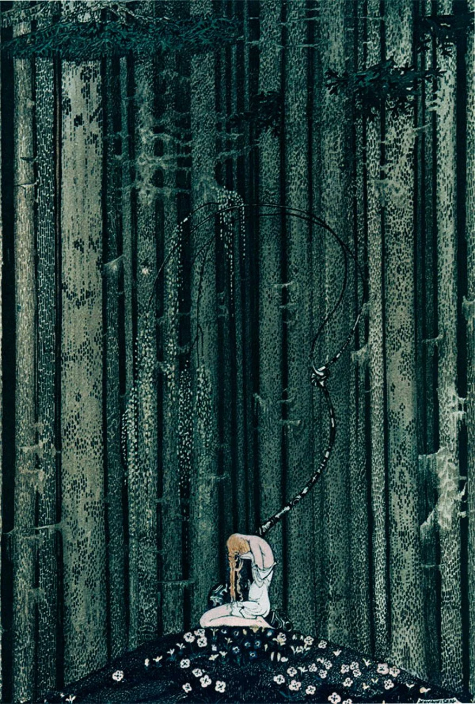

## the eclipse

> for those that seek \
> communion:: \
> there is only one \
> language, one alone \
> the rhythm is \
> in harmony \
> 
> ー the_shepherd :: y100 post-eclipse



**Rei** looked up at the night sky as he made his way through the treetops. He could see the stars shifting into a new formation. 

The rain was getting heavier, and he could see the water level rise before him. It wasn't the flood that he was afraid of, but what followed that was disturbing. The moons were converging, and the eclipse was nearly on its way. 

Down below he could see the animals begin to move up to safer ground. Many of them were used to **the_flood**. Some had developed specialized shelters to wait out the rain, others had adapted their bodies physically to stay submerged for the entire duration of the flood.

**Rei** had no choice but to stay mobile. Because he knew that if he was found, he would be **hunted**. 

+SLICE+

A spear of light grazed his shoulder. **Rei** flinched.

> "I'm in enemy territory now." 🐦‍⬛

He looked around. A rain of arrows started hurling at him from below. One of **the_children** had spotted him.

He whipped out a harness knife and switched course.

-BLIP-

Another **light_spear** hurled near his head

-FWO000OM-

**Rei** whipped out his harpoon, but hesitated.

> "Best not to engage. To engage is to instigate a war" 🐦‍⬛

He dropped down to ground level and touched the floor.

-BLINK-

Three drops appeared on the floor. He drew a reaction pattern and a line in the sand.

```
> self::clone('REI')
```

--

A shadow clone appeared up in the sky. 

-BLINK-

> "hm.. that should keep them busy" 🐦‍⬛

The spears hurled at the shadow clone. **Rei** moved ahead through an opening between the cypress grove.

+THWACK+

A **shadow_axe** came crashing down and sliced the entire cypress grove in half.

> "how? how could it be?" 🐦‍⬛

Arrows, axes, spears came hurling at him from all directions. **the_children** were not falling for parlor tricks anymore.

> "something has changed" 🐦‍⬛

And then, it happened.

+SCHICK+

A **light_spear** impaled **Rei** in his place. Sliced straight through the heart, skewered into the flooding forest floor.

With one last breath, **Rei** tried to free himself, but it was already too late His circuits began to flicker and his body began to disintegrate.

The clouds darkened, river water rose, the moons vanished into a blanket of the night.

It was the eclipse. 

**+BLINK+**

The stars had rearranged themselves into an eyelid.

**+BLINK+**

The sky opened its third eye.

**+BLINK+**

+PANDEMONIUM+

**+BLINK+**

The flood gates were open.

**+BLINK+**