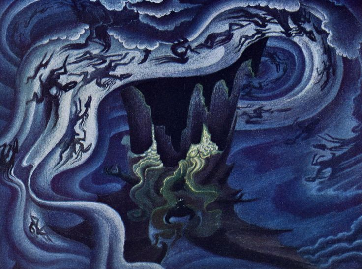

# eye of the storm

Back on the boat, **Chi** was still shivering from shock. Her mind was full of questions.

> Who am I? Why don't I remember anything? Where am I?

One by one, **the_pilot** replied with guttural laughter between sips of pale ale and bad singing.

> HO HO HO! FOR THE LAST TIME, I CAN'T TELL YOU, **spirit**! YOU HAVE TO FIGURE IT OUT.🐦

> ALL I CAN SAY IS, YOU GOTTA FIND THE SHEPHERD. HE HAS ALL THE ANSWERS HO HO HO 🐦

**Chi** felt scared. At least **the_pilot** didn't want to harm her. 

She looked out the window. The rain was starting to get heavier and the winds started to get stronger.

+WHOOSH+

A gale rocked **the_hemingway** to and fro. **Chi** felt her stomach turn.

**the_pilot** had warned her to not look into the sky, for doing so was bad luck.

But **chi** could not resist.

The moons had vanished a day ago. She thought she might have imagined it, but almost seemed as if a large eye appeared in the sky and opened its eyes momentarily.

Right at when the eclipse had happened, she felt an intense pain in her chest. It was as if a part of her had died. She had never felt a pain that intense.

When she looked at her chest, she could see that indeed, there was a clean hole in her chest. She could put her hand and see it emerge from the other side.

Something was calling to her.

+CRACK+

Thunder and lightning. Right ahead was an approaching storm. 

> BUCKLE UP **spirit**, THIS PART'S GOING TO BE FUN! HO HO HO. 🐦

> that's usually a bad thing, **chi** muttered to herself.

+CRACK+

**the_pilot** revved up the engine as **the_hemingway** went to full throttle. The rusty parts started to rattle. A pipe burst somewhere but **the_pilot** didn't seem to care.

+ZOOOOM+

Full speed ahead. The vessel disappeared into the storm.

==

-BLIP-

Time seemed to have stopped. The rain sat still against the window sill like tiny specks of paint on a canvas.

**the_hemingway** drifted slowly into an invisible wall of sound for what seemed like hours.

And then all at once it emerged on the other side of the storm.

> calm

The boat descended slowly onto a clearing. The rain had subsided. She could see an open paddy field in the distance.

> WE ARE HERE **spirit**. ALL GOOD. YOU'RE WITH THE BEST PILOT IN SILENT VALLEY HO HO HO 🎶 🐦

The boat crashed to the ground.

> HO HO HO DID I MENTION THE ONLY PILOT IN SILENT VALLEY? HO HO HO

**Chi** slowly stepped out of her seat. She could see that the rain was beginning to stop and the flood was receding.

> NOT SO FAST HO HO HO. A PILOT IS ALWAYS PAID HIS DUES. 🎶 🐦

**Chi** snapped her fingers and summoned the orb. She had already paid old bird three times during the trip for all sorts of mundane things from asking simple questions to using the vessel's restroom.

> THANK YOU MISS. I'LL BE OFF 🎶 🐦

As he began to turn around, he paused.

> OH BUT ONE LAST THING **spirit**. **the_shepherd** TOLD ME TO GIVE YOU THIS. HO HO HO 🎶 🐦

He handed her a tattered note. 

It read:

> Find me in the land
> East of **the_spiral**
> And West of **the_moon**
> To a place 
> Under the deep below
> Reckon with **the_probe**
> Enter west

> The lab of millets? What did that mean?, she thought

She looked up. **the_pilot** was getting ready to leave.

> Where is the lab of millets?

**the_pilot** laughed. 

> HO HO HO. WEST! YOU MUST GO WEST, he pointed his stick haphazardly to his right.

**the_hemingway** rose up above the clearing in the trees. 

+ZOOM+

It was gone.

**Chi** was alone. But she knew one thing for certain.

She had to find **the_shepherd**. He would have all the answers.

So west she walked, as the mist began to settle on **silent_valley**. 