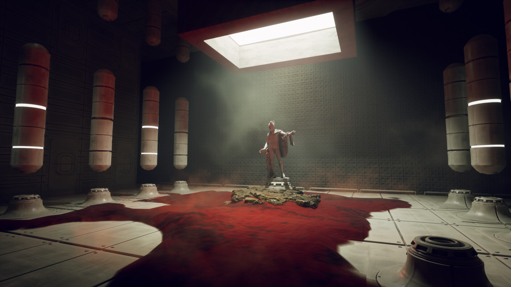

# the echo chamber

**Chi** approached the thick marsh with caution. She could only see so far ahead, but in the distance she could make out a few desolate abandoned buildings with withering white and mustard paint. 

The buildings were surrounded by a metal fence on all sides, with what looked like a field of millet and barley.

The millet fields had remnants of rusty structures and abandoned robots the size of elephants - the detritus of a forgotten war. 

Right by the edge of the fence was an opening with a signboard that read in large mustard letters "**millet_lab**". Above it was a symbol that was possibly the logo of the aforementioned lab.


Below the sign was a small description that read

*this facility is for researchers of the **agricultural_foundation of silent_valley** only. trespassers will be prosecuted*

There was an eerie silence that filled the compound - a silence that lent itself to the hiss of electric signals and murky water. 

She could see the lab was run down and dilapidated from decades of neglect. The windows were broken showing signs of a break-in.

Out of the corner of her eyes **chi** saw something move. She could hear a gentle humming coming from the main building in the center. 

> "I guess I should follow the humming?"

Beside her **the_probe** seemed to glow in agreement.

With nowhere else to go, **chi** reluctantly snuck beneath an opening in the fence and tip-toed towards the humming.

The humming grew louder as **chi** approached the main door of the facility. The door had been pried open and it was just large enough for her to slip in.

+SQUEEEZE+

Another figure scurried from behind her. She turned around quickly.

+FLIT+

> "Must be my imagination"

**Chi** was beginning to feel afraid. Maybe this wasn't the right way. But **the_probe** seemed to glow reassuringly. 

**Chi** trusted its guidance and continued across the mud-strewn corridor.

At the end of the walkway, was a large steel door. It was surprisingly clean and untouched relative to the rest of the building. 

Beside the door on the wall, she could see a device, similar to the one at the end of **the_spiral**.

```
> dial('16-42-24');
```

+TSSSSST+

The combination worked - the door was open!

Steam fell out of the door like a curtain, giving way to a sterile laboratory with an eerie glow. 

The lab room was filled with strange equipment and glass vials. The containers had all sorts of animal body parts, limbs and machinery. She wiped one large flask to take a closer look

<|BLINK|>

A severed eye! **Chi** fell back in horror.

This was no ordinary laboratory. Something sinister was in here with her. 

She glanced that **the_probe**. It had started to pulsate in an odd frequency.

> "maybe it's time to get out of here!"

She turned around. The door had closed behind her!

> "Of course it's locked"

The door wouldn't budge. She had to look for another exit. **the_probe** started to beckon at her to move to the left.

```
> follow()
```

Beyond the desks was a large tank stretched from wall to wall up to the ceiling. Inside it were what seemed like a dozen mice - suspended in an odd greenish liquid. 

**Chi** stepped closer.

+ALARM+\
+ALARM+\
+ALARM+

It seemed like she had triggered something. A loud siren started to sound. The lab red lights turned on and began to flash repeatedly.

The mice in the tank started to move. One of them turned around and looked her dead in the eye.

>AAHHH, **Chi** shrieked.

She fell to the floor. The mice started to climb out of the tank one by one.

**Chi** got up and sprinted with every last ounce of energy she had. Ahead was a room with an open steel door. It seemed heavy enough to stop them. She slipped behind and pushed with all her might.

+CLANG+ 

The door was locked. Through the window pane she could see what seemed like a hundred large mice, each nearly half her size running at her - feral and hungry. They started to rush at the door.

+CLANG+
+CLANG+
+CLANG+

The door seemed to hold. They weren't getting through here.

> "Phewh" **Chi** let out a momentary sigh of relief. 

She turned around to glance at the room. It was dimly lit, Save for a square light aimed at a statue of a man in the center. At his feet was a pool of blood and behind him, complete darkness.




**Chi** slowly inched towards the statue - her footsteps echoing in the silence of the room.

> **Chi** squinted.

She could make out the faint glint of something large and furry behind the statue. 

The silhouette grew larger.

Then, a single enormous mouse with deep red bloodshot eyes emerged from behind the fog.

> "H-AH" **Chi** gasped

The mouse grinned in a sinister way, baring more than a few dozen sharp teeth.

The mouse looked at her from head to toe. Carefully studying her every move.

**the_mouse** spoke slowly:

> *I HAVE BEEN EXPECTING YOU, SPIRIT. THERE IS MUCH TO DISCUSS.* 🐁

An unsettling static noise started to emanate from the walls.

The hole in the chest seemed to grow larger. Could this day get any worse?