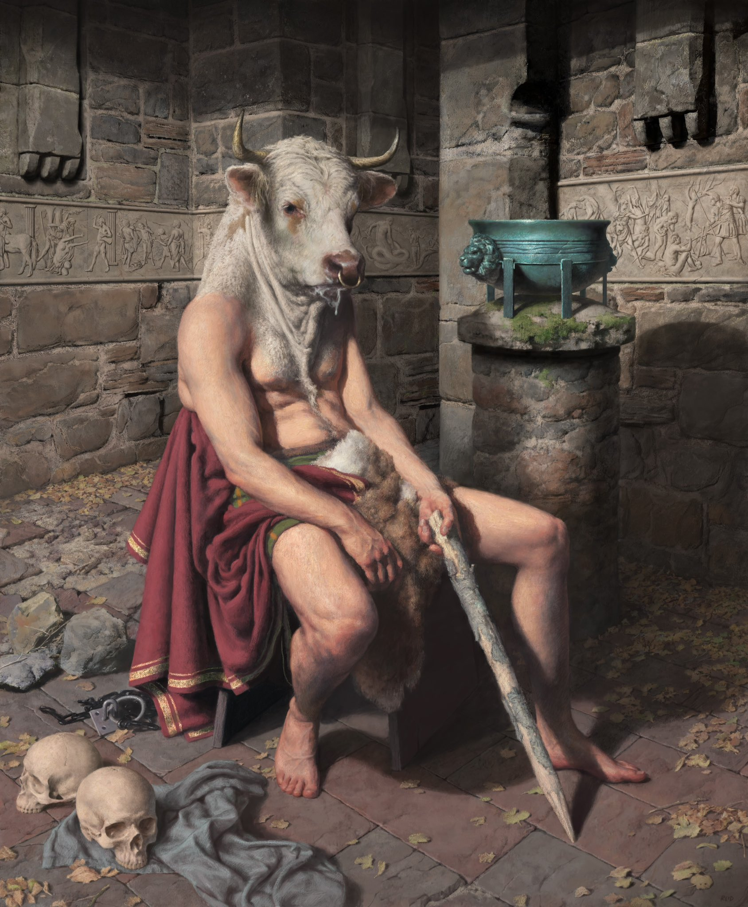

## an exposition

**Chi** was frozen, transfixed at the gaze of the large talking mouse. His red bloodshot eyes seemed to look right through her, but for some reason she felt like he could read her every thought.

**the_mouse** was wearing a crown with several robotic appendages. As he moved into the light she could make out that he was very old and limp in one leg. His tale had been chewed off in several places.

> *GREETINGS, SPIRIT. WELCOME TO MILLET LAB.* he said calmly.
> *DON'T WORRY CHILD, I WONT BITE. ALLOW ME TO INTRODUCE MYSELF* 🐁 

He turned his head up and sniffed the air, almost in as though he was straightening himself uo.

> *I AM *APH^EX^*, THE_MOUSE - CHIEF SCIENTIST AT **AGRICULTURAL_FOUNDATION** OF **SILENT_VALLEY**, FOUNDER OF MILLET LAB* 🐁

He paused.

>*YOU SEE, A FEW DECADES AGO, A FEW OF THE BRIGHTEST MINDS IN SILENT VALLEY SET OUT ON A JOURNEY TO FIND **HYBRID_GENERAL_INTELLIGENCE**.* 🐁

> **hybrid_general_intelligence**? what does that even mean? **chi** thought to herself.

> *IT MEANS WHAT YOU THINK IT MEANS*, APH^EX^ smirked. 🐁

++

> *You can read my thoughts?* **Chi** gasped.

++

> *OF COURSE CHILD. IN DUE TIME YOU SHALL LEARN TO HARNESS THIS POWER TOO... BUT FOR NOW YOU MUST **LISTEN*** 🐁

**Chi** felt incredibly uncomfortable. But for the moment she had no other choice but to listen to him.

> *AS I WAS SAYING*, he continued *IN OUR QUEST FOR FINDING THE CURE TO **THE_PLAGUE** WE TRIED TO SIMULATE HYBRID INTELLIGENCE.* 🐁

He turned to his side.

> *IN OTHER WORDS - **A_HIVE_MIND**. THE MOST INTELLIGENT BEING ON THE PLANET, **CLONED*** 🐁

Things started to make sense... The mice from before were all clones of this one?

> *WE HARNESSED THE POWER OF **GENE_EDITING** AND **SOMATIC_CELL_NUCLEAR_TRANSFER** TO CREATE THE FIRST GENERATION OF HUMAN ANIMAL HYBRIDS - STARTING WITH ME - **APH^EX^**.* 🐁

His eyes turned down in sorrow.

> *BUT THINGS DIDN'T GO ACCORDING TO PLAN. THE EXPERIMENT LEFT ME **BLIND** AND TURNED ALL THE CLONES **FERAL**.* 🐁

His ears twitched.

> ***LADY_PEACOCK** IMPRISONED ME IN **MILLET_LAB** ALONG WITH THE CLONES UNTIL I FOUND A CURE. AFTER SEVERAL DECADES, I HAVE FOUND A CURE. BUT THERE IS **ONE MISSING PIECE*** 🐁

He looked up at **Chi**

>**YOU**

**Chi** knew it before he spoke those words. Something about this conversation seemed familiar. The lab, the broken glasses, the door. She had been here before.

+CLAP+

She snapped as **the_probe** expanded to fill the room with light.

>*THAT'S IT CHILD. YOU SEE - I AM BLIND SO YOUR PROBE WILL NOT WORK. GOOD TRY THOUGH* 🐁

He lifted his tail and grabbed her, slowly wrapping it around her body.

>*IT'S OKAY, IT WILL ONLY LAST A MINUTE* 🐁

**APH^EX^** placed her on the table. A floating chainsaw and surgical knife came towards her hovering right beneath her head over her torso. It inched closer, and closer.. and closer.

> *WAIT A MINUTE. WHAT'S THAT? WHERE IS YOUR **+CORE+**? WHERE DID IT GO?* 🐁

> He must be talking about the hole in my chest, **Chi** thought

> *YES THAT ONE. WHAT DID YOU DO TO IT?* 🐁

> Nothing, **Chi** replied.

***APH^EX^*** loosened his grip.

**Chi** seized the opportunity and wriggled free.

Something seemed familiar about this encounter. She trusted her instincts and jumped up.

Her body floated up in unison and did a full somersault in the air.

While in mid air she clapped her hands in to a series of hand formations.

+EARTH+
+WIND+
+WATER+
+FIRE+

++

+LIGHT+
+SHADOW+

++

+SOUND+
+SILENCE+

++

+ILLUSION+
*REALITY+

++

+DREAM+

The room filled itself with a bright light. ***APH^EX^*** began to shrink. 

He shrank.

and shrank. 

and shrank.

Until he the size of a tiny, frail man with a limp arm. 

**Chi** took a careful look at his body. He looked very familiar to the man in the statue at the center of the room.

Whatever she did, seemed to have worked.

But her mind was full of questions. Why had the shepherd asked her to head west?

It was time for her to question the mad scientist.